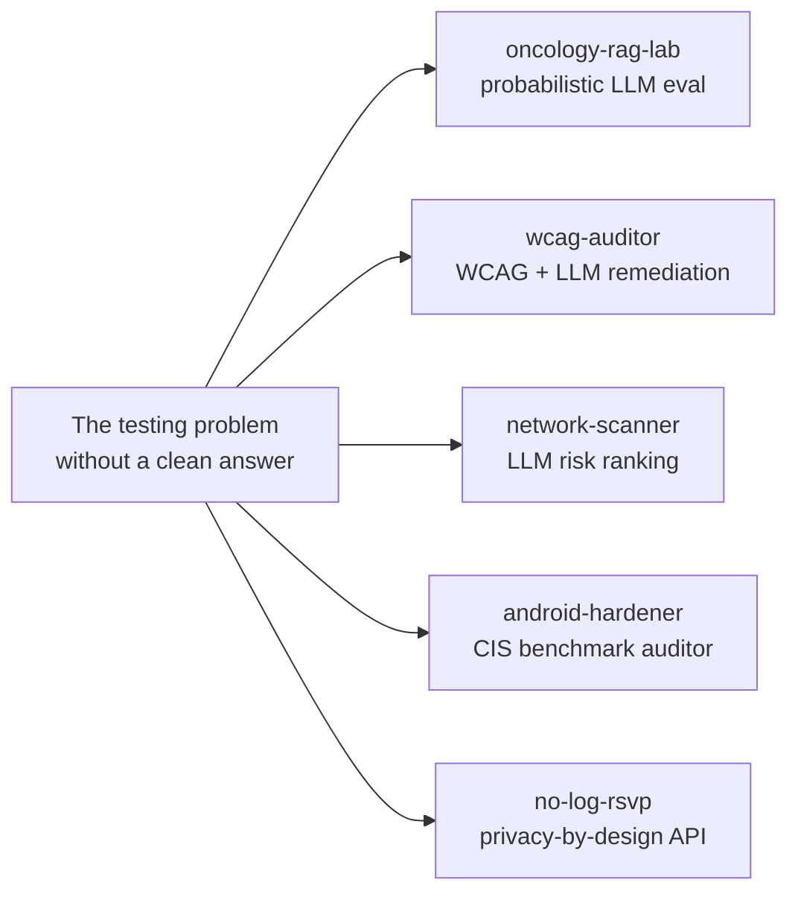

# Wei Jia

The romantic side of me never expected to work in tech. English and History double major, five years in government work and immigration law, months coordinating field operations for a voter registration drive, and I think it's pretty obvious to anybody reading this that I spent most of my early career trying to be somebody else. It took me a while to stop pushing down that critical quality: that I was an utter nerd who loved understanding how systems fit together.

QA engineer at Intuit Mailchimp now, and what I keep gravitating toward is the part of the testing problem that doesn't have a clean answer: LLM pipelines where the output is probabilistic and a fixed assertion misses the point, accessibility audits where the violation ID tells you what's wrong but not what to actually change, network scans where the risk isn't in any individual open port but in what the device combination implies together. It turns out it was really just a matter of cobbling together enough of the problem space to understand what kind of evaluation infrastructure each system actually needed. These five repos are what came out of that. All local inference, no external calls.

---

## Projects

### [oncology-rag-lab](https://github.com/weijia-89/oncology-rag-lab)
RAG eval harness for structured clinical entity extraction

A working LLM pipeline (LlamaIndex + ChromaDB + Ollama) that extracts oncology entities from synthetic clinical notes: AJCC stage, regimen, ECOG, cancer type. The eval harness around it is the main artifact: DeepEval metrics, Arize Phoenix observability, A/B drift comparison, regression gate that fails CI if pass rate drops more than 5 points. Same patterns production oncology platforms run at 150M documents, applied to 8 docs on a laptop.

`LLM eval` `DeepEval` `RAG` `ChromaDB` `LlamaIndex` `Arize Phoenix` `drift detection` `Python`

---

### [wcag-auditor](https://github.com/weijia-89/wcag-auditor)
LLM-augmented WCAG 2.2 accessibility auditor

The standard WCAG workflow: run axe-core, read the violation ID, look up the criterion, figure out what to actually change. This puts a local LLM in the middle of that. Playwright injects axe-core into the page; violations come back as structured objects; each one gets piped through Ollama with enough HTML context to produce a fix suggestion. Pydantic validates the output before it hits your terminal. Audit history in SQLite, HTML stays on the machine.

axe-core catches ~30-40% of WCAG 2.2 issues. This doesn't change that number. It makes the 30-40% easier to act on.

`accessibility` `WCAG 2.2` `axe-core` `Playwright` `LLM` `Ollama` `Pydantic` `Python`

---

### [network-scanner](https://github.com/weijia-89/network-scanner)
Local-LLM risk-ranked network scanner

ARP sweep + nmap on a /24, followed by a local LLM walking the device list and flagging the cameras, the unencrypted MQTT brokers, the streaming sticks, the routers with too many admin surfaces. Everything stays on the box. Real scans need `--confirm` as a legal acknowledgment that you own the target subnet.

`network security` `nmap` `LLM` `Ollama` `infosec` `Python`

---

### [android-hardener](https://github.com/weijia-89/android-hardener)
Read-only CIS Android Benchmark auditor

Connects to a device over ADB, evaluates 15 CIS Android Benchmark controls, produces a prioritized hardening report with local LLM analysis. Will never write to the device. Mock fixtures let the full eval suite run without a connected phone.

`Android` `CIS Benchmark` `ADB` `security auditing` `LLM` `Ollama` `Python`

---

### [no-log-rsvp](https://github.com/weijia-89/no-log-rsvp)
Privacy-by-design RSVP API: headcounts, not names

Stores event title, timestamp, and headcount. No names, no emails, no IPs, no accounts. Everything deletes 24h after the event. An LLM-backed PII guard rejects event descriptions containing personal information at the API boundary. EXIF/XMP metadata stripped from uploaded images. Threat model and full data inventory in SECURITY.md + PRIVACY_MODEL.md.

`privacy engineering` `PII detection` `FastAPI` `SQLite` `LLM` `Ollama` `Python`

---

## What connects them

Five projects, one recurring gap. Each standard tool produces data (port states, violation IDs, LLM outputs, a device list) but the step from that data to a useful answer had to be built from scratch each time. For oncology-rag-lab, that meant a DeepEval harness with a regression gate, because probabilistic outputs don't fail cleanly against fixed assertions. For wcag-auditor, getting from a rule ID to the actual HTML change required feeding the violation plus its surrounding context through a local model. For network-scanner, the LLM pass walks the full device list for dangerous combinations: the camera-plus-admin-port-plus-unencrypted-broker pattern no single port flag would surface. For android-hardener, a strictly read-only pipeline keeps audit results trustworthy; an apply mode would undermine that. For no-log-rsvp, the privacy claim is enforced at the schema level: no description column, anonymous IDs only, 24h auto-delete.

| Problem | Project |
|---|---|
| LLM outputs are probabilistic, unit tests aren't enough | oncology-rag-lab |
| Accessibility violations need context to fix, not just IDs | wcag-auditor |
| Network risk depends on device combination, not individual ports | network-scanner |
| Compliance gaps aren't visible without a device in hand | android-hardener |
| Privacy properties can't be proven by reading the code alone | no-log-rsvp |

All five use Ollama for local inference, SQLite for audit history, and `MOCK_LLM=1` to run the full test suite in CI without a model server.

---

## Stack

Python · FastAPI · Playwright · axe-core · LlamaIndex · ChromaDB · DeepEval · Arize Phoenix · Ollama (llama3.1:8b, qwen3:14b, nomic-embed-text) · Pydantic · SQLite · nmap · ADB · uv · pytest · GitHub Actions

---

## Contact

[LinkedIn](https://linkedin.com/in/wei-jia)
